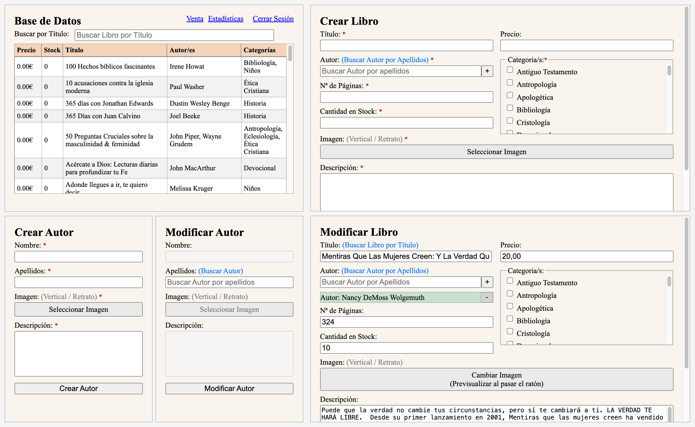
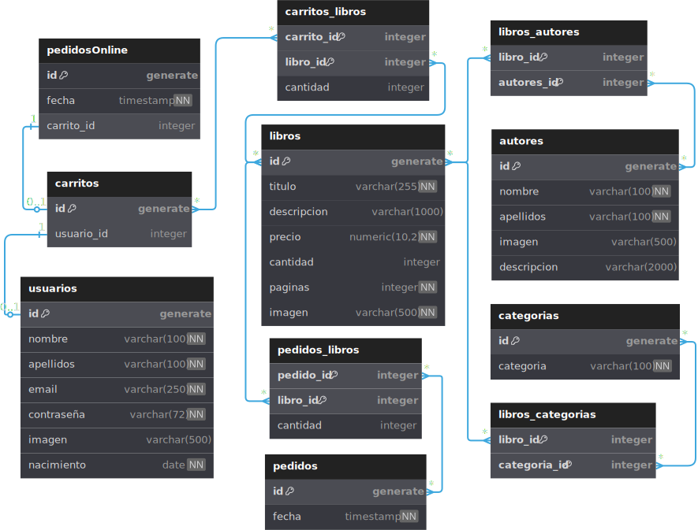

# &nbsp; ICPF - Librería Baluarte de la Verdad 
## REST API Backend (Full-Stack PENV App)

Este es el Backend de la Full-Stack PENV App creada para la Iglesia Caminando por Fe. Este es el enlace del frontend: [https://github.com/JonaRhood/ICPF](https://github.com/JonaRhood/ICPF). 

El Backend ha sido desarrollado como una REST API utilizando **PostgreSQL**, **Express** y **Node.js**. El backend ha sido desplegado en **Railway**, mientras que la base de datos se aloja en **Supabase**, permitiéndome aprender mucho sobre la integración entre diferentes proveedores de servicios.

## 📋 Tabla de Contenidos
1. [Resumen del Proyecto](#resumen-del-proyecto)
2. [Características](#caracteristicas)
3. [Tecnologías Utilizadas](#tecnologias-utilizadas)
4. [Contacto](#contacto)

## ✏️ <a id="resumen-del-proyecto">Resumen del Proyecto</a>
Este backend proporciona una **API REST robusta, segura y escalable** para la gestión eficiente de la **Librería Baluarte de la Fe** de ICPF. La arquitectura está diseñada para garantizar la integridad y seguridad de los datos mediante **encriptación de contraseñas con bcrypt**, autenticación basada en sesiones con **express-session**, y validaciones estrictas con **express-validator**. Además, se ha optimizado el almacenamiento y rendimiento utilizando **PostgreSQL** alojado en **Supabase**, asegurando una experiencia ágil y confiable.  

## ⚙️ <a id="caracteristicas">Características 

- **🔐 Autenticación Segura**  
  Implementación de **Passport.js** con estrategias locales para gestionar el inicio de sesión de usuarios de manera segura, reforzado con encriptación avanzada.

- **🔑 Gestión de Sesiones**  
  Uso de **express-session** con almacenamiento en **Supabase**, permitiendo persistencia de sesiones de usuario de forma eficiente y segura.

- **🖼️ Carga y Procesamiento de Imágenes**  
  Integración de **Sharp** y **Busboy** para la carga, conversión y compresión de imágenes en **formato .webp**, optimizando el uso del almacenamiento en **Supabase** y asegurando una alta calidad con menor tamaño de archivo.

- **🛡️ Validaciones y Seguridad**  
  Protección del servidor con **helmet** y **CORS**, garantizando un entorno seguro ante ataques como **XSS**, **CSRF** y **inyección de código**. Validaciones en los endpoints con **express-validator** para evitar datos inconsistentes.

- **📚 Documentación de la API**  
  Documentación interactiva con **Swagger UI**, facilitando la comprensión e integración de la API por parte de desarrolladores y clientes.

- **📊 Monitoreo y Registro de Peticiones**  
  Implementación de **Morgan** como middleware para registrar solicitudes HTTP, permitiendo un seguimiento detallado del tráfico y posibles errores en el servidor.

- **💻 Software Cliente para Gestión Integral**  
  Se ha desarrollado un software cliente diseñado específicamente para los encargados de la librería, permitiéndoles gestionar la librería de manera eficiente y en tiempo real. La aplicación permite registrar y modificar libros y autores, gestionar el proceso de venta de libros, y visualizar estadísticas detalladas sobre ventas y productos. Al estar completamente integrado con el backend, garantiza que toda la información se almacene y actualice en línea, facilitando la administración y asegurando la disponibilidad de datos en cualquier momento y desde cualquier dispositivo.

  

  
  

- **📊 Modelo de Datos Estructurado**: Se ha diseñado un **Diagrama de Relaciones de Entidad (ERD)** que define la estructura de la base de datos en **PostgreSQL**, asegurando integridad referencial, eficiencia en las consultas y escalabilidad. Este modelo permite gestionar relaciones clave como libros, autores, ventas y usuarios de manera optimizada.

  

    
  

(<a href="#readme-top">volver arriba</a>)

### 🔧 <a id="tecnologias-utilizadas">Tecnologías Utilizadas
[![NODEJS][Node.js]][Node-url]
[![EXPRESS][Express.js]][Express-url]
[![Postgres][Postgres]][Postgres-url]
[![Supabase][Supabase]][Supabase-url]
[![Railway][Railway]][Railway-url]
[![Passport][Passport]][Passport-url]
[![Swagger][Swagger]][Swagger-url]
[![DOTENV][Dotenv]][Dotenv-url]
[![ESLINT][Eslint]][Eslint-url]
[![NODEMON][Nodemon]][Nodemon-url]

(<a href="#readme-top">volver arriba</a>)

## 👤 <a id="contacto">Contacto</a>

[![LinkedIn][linkedin-shield]][linkedin-url]  
Jonathan Cano -  jonathancanofreta@gmail.com

(<a href="#readme-top">volver arriba</a>)

[Node.js]: https://img.shields.io/badge/NODE.JS-20232A?style=for-the-badge&logo=Node.js
[Node-url]: https://nodejs.org/en
[Express.js]: https://img.shields.io/badge/EXPRESS-20232A?style=for-the-badge&logo=express
[Express-url]: https://expressjs.com/es/
[Postgres]: https://img.shields.io/badge/POSTGRESQL-20232A?style=for-the-badge&logo=PostgreSQL
[Postgres-url]: https://www.postgresql.org/
[Supabase]: https://img.shields.io/badge/SUPABASE-20232A?style=for-the-badge&logo=Supabase
[Supabase-url]: https://supabase.com/
[Railway]: https://img.shields.io/badge/RAILWAY-20232A?style=for-the-badge&logo=Railway
[Railway-url]: https://railway.com/
[Passport]: https://img.shields.io/badge/Passport-20232A?style=for-the-badge&logo=Passport
[Passport-url]: https://supabase.com/
[Swagger]: https://img.shields.io/badge/Swagger-20232A?style=for-the-badge&logo=Swagger
[Swagger-url]: https://swagger.io/
[Dotenv]: https://img.shields.io/badge/.ENV-20232A?style=for-the-badge&logo=.env
[Dotenv-url]: https://www.dotenv.org/
[Eslint]: https://img.shields.io/badge/ESLINT-20232A?style=for-the-badge&logo=ESLint
[Eslint-url]: https://eslint.org/
[Nodemon]: https://img.shields.io/badge/Nodemon-20232A?style=for-the-badge&logo=Nodemon
[Nodemon-url]: https://nodemon.io/

[linkedin-shield]: https://img.shields.io/badge/-LinkedIn-blue.svg?style=for-the-badge&logo=linkedin&colorBlue
[linkedin-url]: https://www.linkedin.com/in/jonathancanocalduch